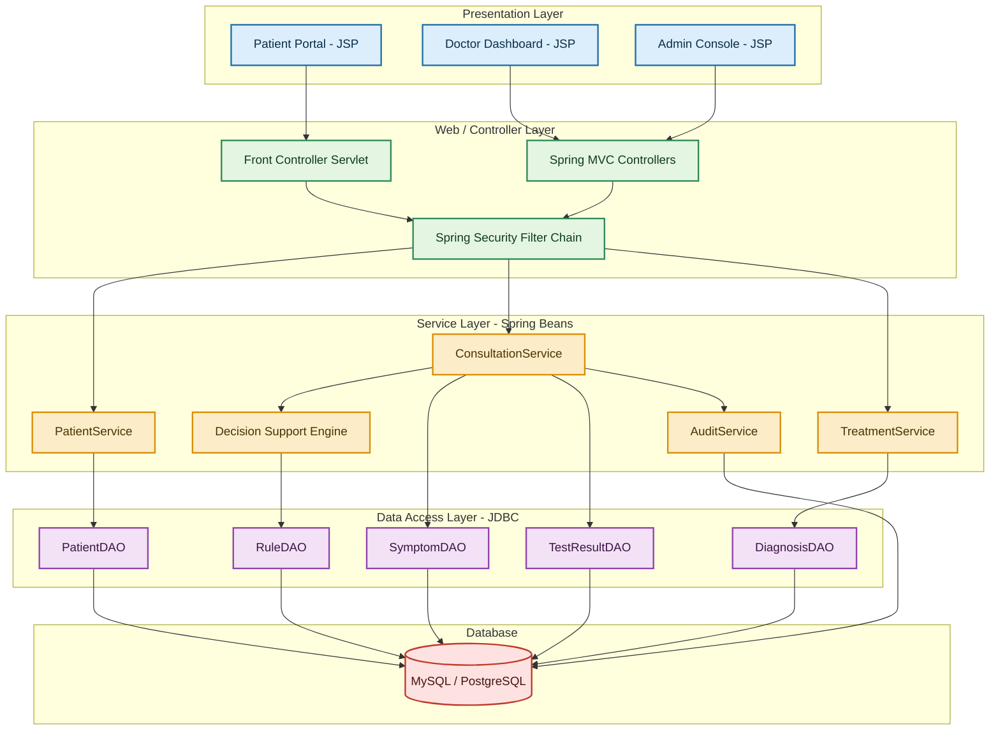
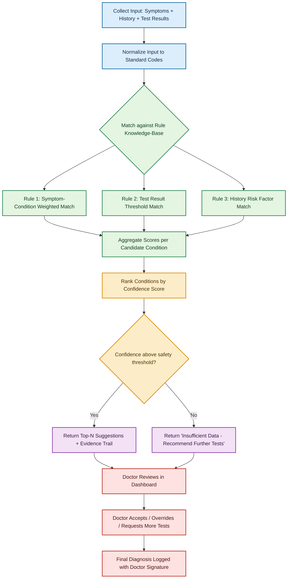
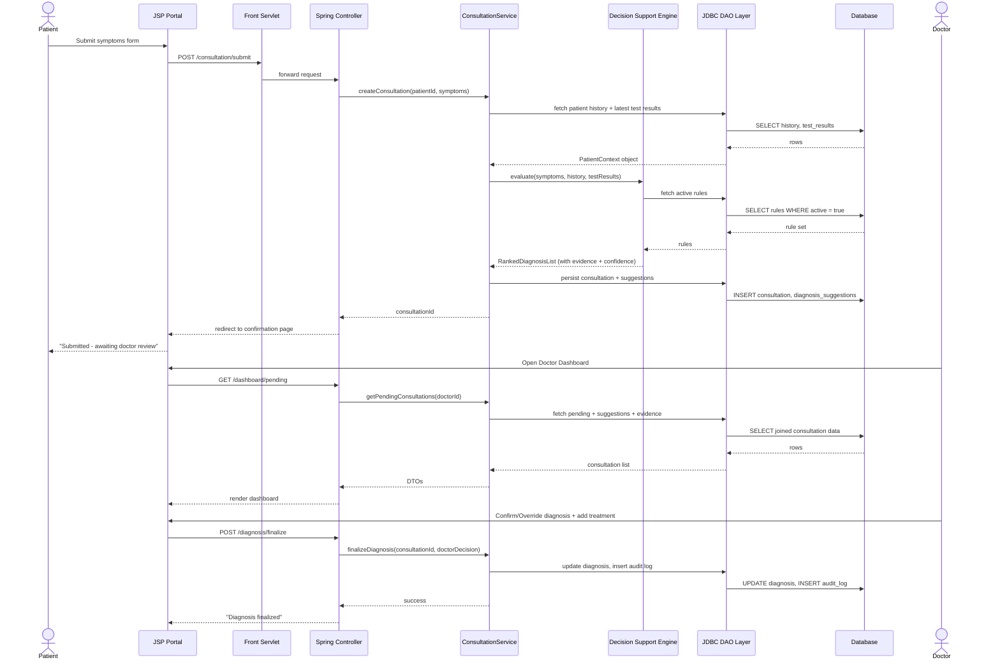
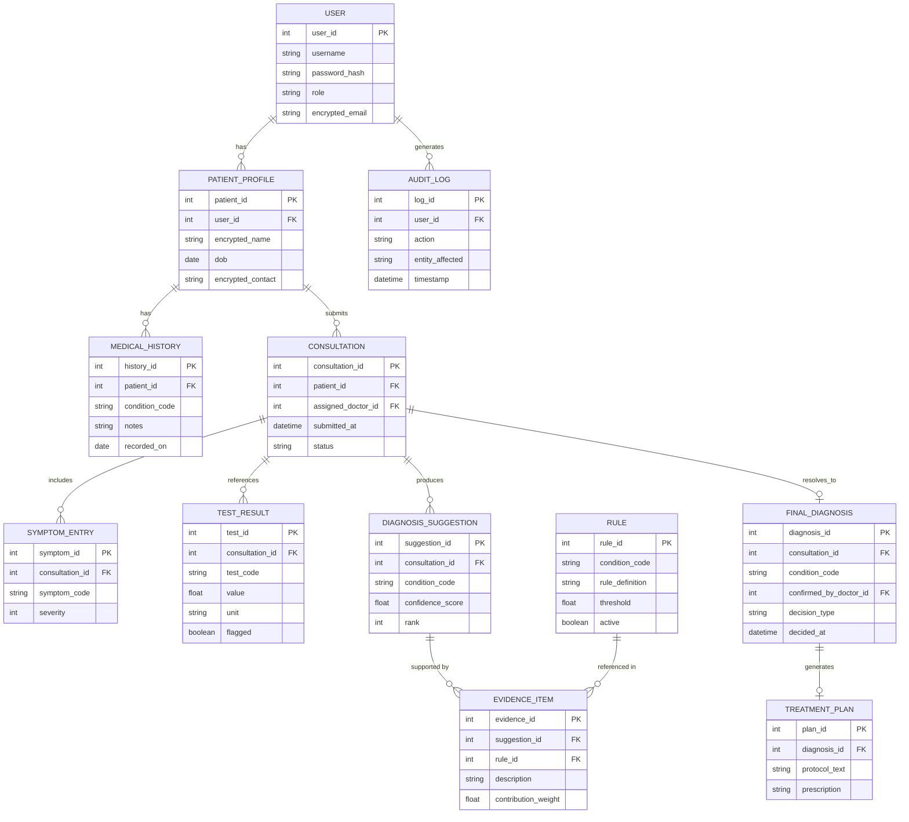

# MedAssist — Clinical Decision Support System (CDSS)

> A system assisting healthcare professionals in medical diagnosis and treatment recommendations, analyzing patient symptoms, medical history, and test results — with decision support and patient data privacy.
> **Stack:** Servlets · JSP · JDBC · Spring (Core + MVC + Security)

---

## 1. Problem Statement

Doctors juggling high patient loads often don't have time to cross-reference a patient's full history, current symptoms, and lab results before making a call. Misdiagnosis or delayed diagnosis due to information overload is a real, documented problem in clinical settings.

**MedAssist doesn't replace the doctor.** It's a decision-support layer: it aggregates patient data (history + symptoms + test results), runs it through a rule-based inference engine, and surfaces **ranked, explainable diagnosis suggestions with confidence scores** — the doctor reviews, accepts, overrides, or requests more tests. Every decision is logged for accountability. Patient data stays encrypted and access-controlled throughout.

### Non-goals (be upfront about this in your report/viva)
- This is **not** a replacement for a licensed physician — it's a decision-support aid.
- No ML model training is claimed — the reasoning engine is deterministic/rule-based (a real hospital pilot would need clinical validation before any ML claims anyway; keep the scope honest).

---

## 2. Actors

| Actor | Role |
|---|---|
| **Patient** | Registers, submits symptoms, views own history & recommendations (read-only) |
| **Doctor** | Reviews patient data + engine suggestions, confirms/overrides diagnosis, prescribes treatment |
| **Lab Technician** | Enters/uploads test results against a patient record |
| **Admin** | Manages users, roles, and the clinical rule knowledge-base |

---

## 3. High-Level Architecture



**Why this layering matters for the viva:** Servlets act as the front-controller for legacy/simple flows (login, file upload), Spring MVC handles the richer request routing (`@Controller`, `@Service`, `@Repository`), and JDBC (either raw `java.sql` or Spring's `JdbcTemplate`) is the actual data-access mechanism underneath JPA-less DAOs — this is exactly what your project brief asks for (Servlets + JSP + JDBC + Spring together, not one replacing the other).

---

## 4. Core Modules

1. **Auth & Access Control** — Spring Security; role-based (`PATIENT`, `DOCTOR`, `LAB_TECH`, `ADMIN`); session-based auth via `HttpSession`, backed by encrypted credentials.
2. **Patient Management** — demographics, medical history (allergies, chronic conditions, past diagnoses).
3. **Symptom Intake** — structured symptom entry (not free text) mapped to a standard symptom taxonomy — this structure is what makes rule matching possible.
4. **Test Result Management** — lab technician enters results; flagged against normal ranges automatically.
5. **Decision Support Engine (DSE)** — the core: rule-based inference over symptoms + history + test results → ranked diagnosis suggestions with confidence + supporting evidence per suggestion.
6. **Treatment Recommendation** — maps confirmed diagnosis → standard treatment protocol templates (doctor edits before finalizing).
7. **Audit & Privacy** — every read/write to patient data logged (who, what, when); PII fields encrypted at rest (AES) via a `@Convert`-style JDBC wrapper or manual encryption in the DAO layer.

---

## 5. Decision Support Engine — Design

Keep this deterministic and explainable (a rules/weighted-scoring engine, not a black box) — this is what makes it defensible in a viva when someone asks "is this real AI?"



**Rule structure (stored in DB, editable by Admin — this is your "knowledge base management" feature):**

| Rule Component | Example |
|---|---|
| Condition | Type 2 Diabetes |
| Symptom weights | Frequent urination (0.3), Excessive thirst (0.3), Fatigue (0.15) |
| Test thresholds | Fasting glucose > 126 mg/dL (0.4 weight, hard flag) |
| Risk factors | Family history diabetes (+0.1), BMI > 30 (+0.1) |
| Safety threshold | Suggestion only surfaces if aggregate score ≥ 0.6 |

This gives you a genuinely explainable system: every suggestion the doctor sees comes with *why* — which symptoms, which test result, which history factor contributed, and by how much.

---

## 6. End-to-End Data Flow (Sequence Diagram)



---

## 7. Database Schema (ER Diagram)



---

## 8. Security & Privacy Design

| Concern | Approach |
|---|---|
| Authentication | Spring Security, BCrypt password hashing |
| Authorization | Role-based access control at controller + service layer (`@PreAuthorize`) |
| PII protection | AES encryption for name/contact fields, applied/decrypted in the DAO layer before/after JDBC calls |
| Data-in-transit | HTTPS (self-signed cert acceptable for demo) |
| Audit trail | Every read/write on patient records logged to `AUDIT_LOG` — required for any real healthcare system (this maps to real-world HIPAA-style accountability, good talking point in viva) |
| Session security | Server-side sessions, session timeout, CSRF tokens on all JSP forms |

---

## 9. Key Endpoints (Servlet + Spring MVC mix)

| Endpoint | Layer | Purpose |
|---|---|---|
| `/auth/login` | Servlet | Session-based login |
| `/patient/register` | Spring MVC | Patient signup |
| `/consultation/submit` | Spring MVC | Submit symptoms + trigger DSE |
| `/lab/upload-result` | Servlet (multipart) | Lab tech uploads/enters test results |
| `/dashboard/pending` | Spring MVC | Doctor's pending review queue |
| `/diagnosis/finalize` | Spring MVC | Doctor confirms/overrides diagnosis |
| `/admin/rules` | Spring MVC | Admin manages rule knowledge-base |
| `/audit/logs` | Spring MVC | Admin views audit trail |

---

## 10. Suggested Package Structure

```
medassist/
├── src/main/java/com/medassist/
│   ├── controller/        (Spring MVC controllers)
│   ├── servlet/           (Front controller + upload servlets)
│   ├── service/           (PatientService, ConsultationService, DecisionSupportEngine, TreatmentService, AuditService)
│   ├── dao/               (JDBC DAOs — PatientDAO, SymptomDAO, TestResultDAO, RuleDAO, DiagnosisDAO)
│   ├── model/             (POJOs: Patient, Consultation, Symptom, TestResult, Rule, Diagnosis)
│   ├── security/          (Spring Security config, encryption utils)
│   └── config/            (Spring config, DataSource/JDBC config)
├── src/main/webapp/
│   ├── WEB-INF/jsp/       (patient-portal, doctor-dashboard, admin-console)
│   └── WEB-INF/web.xml
└── src/main/resources/
    └── application properties / spring context XML
```

---

## 11. Why This Is Defensible as a "Real Product Workflow" (viva talking points)

- **Explainability over black-box AI** — every suggestion shows its evidence trail; you can defend this against "is this just hardcoded if-else?" by pointing to the weighted rule-scoring + threshold-based confidence system, which is how real early clinical decision support tools (e.g., rule-based CDSS before ML-era) actually worked.
- **Human-in-the-loop by design** — the system never auto-diagnoses; doctor confirmation is mandatory. This is the correct, responsible pattern for any real healthcare software.
- **Audit trail** — non-negotiable in any real healthcare system; shows you understand compliance concerns beyond just "make the CRUD work."
- **Layered architecture matching the mandated stack** — Servlets, JSP, Spring, JDBC each doing the job they're actually good at, not just present for the sake of the syllabus checklist.

---

## 12. Future Enhancements (mention in report, don't over-promise)

- Swap the rule engine for a trained ML classifier once labeled clinical data is available (out of scope for this project).
- Add a notification service (email/SMS) for patients when diagnosis is finalized.
- Multi-facility support (hospital_id scoping across all tables).
